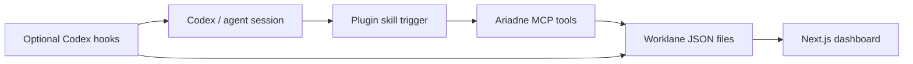

# Ariadne Worklanes Product Plan

## Product Thesis

Ariadne Worklanes is local observability for agent-operated work.

Production, staging, DevOps, data recovery, release, QA, and incident sessions can run for hours across several terminals and agent threads. The agent transcript is a poor source of truth for "where are we now?" Ariadne makes each long-running work item a visible lane with a small structured status file and a dashboard card.

The product stays intentionally small:

- agents own status updates
- MCP owns the write API
- the dashboard owns visualization
- JSON files own persistence
- the plugin owns discoverability and agent nudging

No database is needed for v1.

## Target Users

- Developers running multiple agent sessions locally.
- Operators managing production/staging rollouts.
- DevOps engineers monitoring deploys, queues, migrations, and recovery jobs.
- Teams using Codex where work continuity matters more than chat transcript archaeology.

## Core User Story

"I have several long-running tasks in flight. Show me concise cards that tell me what each task is, when it started, how far it has moved, what changed from baseline, what is blocked, and what needs to happen next."

## Architecture

### Components

1. **Codex plugin**
   - Bundles the skill, MCP config, and future hooks.
   - Presents Ariadne as one installable workflow.
   - Makes the agent aware that long-running work should be tracked.

2. **Skill**
   - The primary agent-facing workflow.
   - Uses a broad trigger description: long-running ops, deploys, recovery jobs, investigations, QA passes, and multi-session work.
   - Tells agents when to start, update, block, hand off, or complete lanes.

3. **MCP server**
   - The only supported writer for worklane files.
   - Exposes simple tools:
     - `start_worklane`
     - `update_worklane`
     - `complete_worklane`
     - `list_worklanes`
   - Publishes MCP server instructions so connected clients see cross-tool guidance even before a specific tool is selected.

4. **Worklane files**
   - One JSON file per lane.
   - Local-first, inspectable, git-friendly, and easy to repair manually.
   - Default location: `~/.ariadne-worklanes/worklanes`.

5. **Dashboard**
   - Next.js app.
   - Reads worklane JSON files.
   - Renders concise cards with progress bars, time, baseline/current metrics, blockers, next actions, and notes.

## Agent Nudging Strategy

The goal is not to make Boris remember to say "use Ariadne." The plugin should make Ariadne the natural default for the relevant class of work.

### Layer 1 - Skill Implicit Invocation

Codex skills can be invoked implicitly when the user request matches the skill description. Ariadne's skill description should front-load words agents are likely to see:

- long-running
- ops
- DevOps
- deploy
- production
- staging
- recovery
- current stats
- delta from start
- blocker
- handoff
- milestone

The skill should stay short and imperative. It should tell agents to start a lane when the task has a baseline, target, queue, rollout, or multi-step process, and to update it at major milestones.

### Layer 2 - MCP Server Instructions

MCP servers can provide server-wide instructions. Ariadne should use that field to remind agents:

- start a worklane for long-running work
- update it at major milestones
- mark blockers explicitly
- add a next action before ending the session
- keep cards concise and put detailed evidence behind links

This is the best general nudge because it travels with the tools.

### Layer 3 - Optional Hooks

Hooks are the enforcement/escalation layer, not the first layer.

Production-ready hooks should be opt-in because Codex requires trust review for non-managed command hooks. Useful hooks:

- `SessionStart`: list active lanes and stale lanes.
- `UserPromptSubmit`: detect phrases like "current stats", "delta from start", "how far are we", "what is still running" and remind the agent to use Ariadne.
- `PostToolUse`: after deploy/queue/test commands, suggest or record a milestone when a lane is active.
- `Stop`: if a session touched tools and an active lane is stale, prompt for a final `update_worklane` before handoff.

Hooks should not invent progress. They should nudge, summarize, or detect staleness. The agent remains responsible for truthful status.

## Worklane Data Model

Required fields:

- `schemaVersion`
- `id`
- `title`
- `status`
- `startedAt`
- `updatedAt`
- `progress.current`
- `progress.total`
- `progress.unit`

Optional fields:

- `summary`
- `scope`
- `completedAt`
- `baseline`
- `metrics`
- `nextAction`
- `blocker`
- `links`
- `notes`

Production-ready additions:

- `owner`
- `workspace`
- `repo`
- `threadId`
- `sessionId`
- `lastActor`
- `milestones`
- `events`
- `evidence`
- `warnings`
- `staleAfterMinutes`
- `schemaVersion` migrations

## Dashboard Features

### V1

- Card grid.
- Progress bar per lane.
- Status chips: planned, active, waiting, blocked, complete, cancelled.
- Started time, elapsed time, last update age.
- Baseline/current metric snippets.
- Next action.
- Blocker.
- Short notes.
- Source directory display.
- Empty state.

### Production V1.5

- Filters by status, repo, owner, and workspace.
- Sort by stale, blocked, recently updated, or oldest active.
- Staleness highlighting.
- Dedicated lane detail page.
- Milestone timeline.
- Compact "operator mode" view for a side monitor.
- Copy/share summary button.
- Open linked files, PRs, runbooks, and logs.
- File watcher or SSE refresh instead of manual refresh.
- Schema validation warnings in UI.

### Later

- Historical archive view.
- Diff view for baseline to current metrics.
- Multiple data directories.
- Team mode over a shared folder.
- Optional static export for read-only evidence.
- Lightweight desktop wrapper if useful.

## MCP Tool Design

### `start_worklane`

Creates a lane with baseline context.

Use when:

- a long-running task starts
- a recovery/deploy/investigation gets a baseline
- the agent realizes the task will span multiple steps

### `update_worklane`

Updates material status.

Use when:

- progress changes
- a job changes state
- a blocker appears
- a milestone lands
- the next action changes
- a side session needs handoff context

### `complete_worklane`

Marks the lane complete and sets progress to total.

Use only when no required work remains.

### `list_worklanes`

Lets agents orient before starting adjacent work.

Future tools:

- `add_milestone`
- `record_metric_delta`
- `set_blocker`
- `clear_blocker`
- `attach_evidence`
- `archive_worklane`
- `summarize_worklanes`

## Production Readiness

### Reliability

- Atomic file writes: write temp file, then rename.
- File locking or conflict detection for parallel agents.
- Preserve unknown fields for forward compatibility.
- JSON schema validation on writes.
- Dashboard never crashes on one malformed lane file.
- Dashboard shows malformed files as repair-needed cards.

### Agent Truthfulness

- Tools should not calculate magic progress unless given inputs.
- Hooks should not write fake status.
- The MCP should record `updatedAt` automatically.
- The app should show stale cards clearly.
- Agents should link evidence instead of pasting large logs.

### Distribution

- Public GitHub repo.
- MIT license.
- Codex plugin manifest at repo root.
- Document local install, build, and plugin install.
- Add a repo or personal marketplace example.
- Consider publishing MCP package later if useful.

### Security And Privacy

- Local-first by default.
- No external network calls required after install.
- Worklane files may contain operational context, so never upload them automatically.
- Redact or link secrets instead of copying them into cards.
- Make the data directory configurable.

### Testing

- Typecheck MCP and dashboard.
- Unit test worklane file writes.
- Unit test schema migration helpers.
- Dashboard fixture tests for active, blocked, stale, malformed, and complete lanes.
- Playwright screenshot check for desktop/mobile card layout.
- MCP smoke test that starts a stdio server and calls tools.

## Implementation Milestones

1. **Repo bootstrap**
   - Monorepo, plugin manifest, MCP server, dashboard, schema, sample data.

2. **MCP writer hardening**
   - Atomic writes.
   - Schema validation.
   - Append-only event history.
   - Better errors when a lane is missing.

3. **Dashboard production pass**
   - Filters, stale states, lane detail page, file watcher/SSE, malformed-file handling.

4. **Agent nudge pass**
   - Refine skill trigger text.
   - Add `agents/openai.yaml` metadata.
   - Add MCP instructions.
   - Prototype opt-in hooks.

5. **Plugin packaging pass**
   - Validate manifest.
   - Add install docs.
   - Add marketplace example.
   - Add logo and screenshots.

6. **Quality pass**
   - Tests.
   - Playwright visual verification.
   - CI.
   - Release notes.

## Design Principles

- One card should be enough to reorient.
- Progress must be explainable.
- Stale is a first-class state.
- Links beat pasted logs.
- Files beat databases until files hurt.
- Agents update facts; the app visualizes facts.
- The plugin nudges behavior, but never fabricates progress.

## Official Codex Grounding

This plan uses current Codex documentation for the extension strategy:

- Skills are reusable workflows and can be invoked implicitly based on their description.
- Plugins are the installable distribution unit for skills, MCP config, apps, and related assets.
- MCP connects Codex to tools and can provide server-wide instructions.
- Hooks can run on lifecycle events like `SessionStart`, `UserPromptSubmit`, `PostToolUse`, and `Stop`, but should be opt-in because command hooks require trust review.
